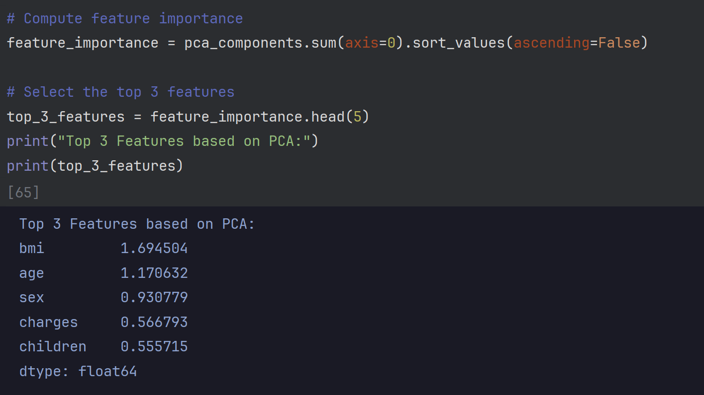

# Medical Insurance Cost Prediction

This project is a Flask-based web application that predicts health insurance costs for individuals based on various attributes. The prediction model was trained using a dataset from [Kaggle](https://www.kaggle.com/datasets/willianoliveiragibin/healthcare-insurance) with the following features:

- `age`: Age of the individual
- `sex`: Gender (`male` or `female`)
- `bmi`: Body Mass Index (BMI)
- `children`: Number of children
- `smoker`: Smoking status (`yes` or `no`)
- `region`: Region of residence
- `charges`: Medical insurance cost (target variable)

The dataset has a shape of `(1338, 7)`.


---

## Project Structure

# 📁 Medical-Inssurance
```
├── 📂.venv
├── 📂 template
├── 📄 app.py
├── 📄 insurance_data.csv
├── 📄 Medical_Inssurance_predictor.pkl 
├── 📄 Medical_Inssurance_test.ipynb
├── 📄 requirements.txt
└── 📄 scaling.pkl
```
---

## Installation and Setup

### Prerequisites
- Python 3.8 or later
- Pip for managing dependencies
- Virtual environment (recommended)

### Steps

1. Clone this repository:
```bash
   git clone <repository-url>
   cd Medical-Insurance
```
```bash   
    python -m venv .venv
    source .venv/bin/activate  # On Windows: .venv\Scripts\activate
```
```bash 
    pip install -r requirements.txt
```
```bash
    python app.py
```

### Scatter Matix of the dataset :

<div style="text-align: center;">
    
</div>


## Data Processing 

<div style="text-align: center;">
    
</div>

The dataset was already clean, so I did not need to perform additional 
preprocessing like handling missing values . However, 
the following steps were performed to prepare the data for training 
the prediction model :

### 1. Encoding Categorical Variables :

The categorical `features`, `sex`, `smoker`, and `region`, were converted 
into numerical values using one-hot encoding to make them
suitable for model training.

### 2. Feature Selection :
To determine the most relevant features for
predicting medical insurance costs, I applied three feature
selection techniques: `Univariate Selection`, **Principal Component Analysis** `PCA`, 
and **Recursive Feature Elimination** `RFE`. The results are as follows :

#### 2.1 Univariate Selection:
Using statistical tests, I selected 
the features most strongly correlated with the target variable `charges`.
Selected Features:
`age`, `sex`, `bmi`, `children` , ` smoker`


#### 2.2 Principal Component Analysis ( PCA ) :
PCA was used to identify the top features contributing 
to the variance in the dataset. The top 3 features based on PCA are:
`bmi`, `age`, `sex`



#### 2.2 Recursive Feature Elimination (RFE):
RFE was applied to iteratively select features by recursively considering smaller and smaller feature sets.
Selected Features : `age`, `sex`, `bmi`, `children` , ` smoker`


By the way i test the number of features selected with the Evaluation of the model 
of the model and i decide to leave 4 features in the prediction  

## Model Training and Evaluation

This project uses a **Bagging Regressor** with a **Decision Tree Regressor** as the base estimator to predict medical insurance costs. Below are the steps involved in the process:

### Features and Target

The dataset was split into **features (X)** and the **target variable (y)**:

#### Features (X):
- `age`: Age of the individual
- `sex`: Gender (male or female)
- `bmi`: Body Mass Index
- `children`: Number of children
- `smoker`: Smoking status (yes or no)

#### Target (y):
- `charges`: Medical insurance costs

### Data Preprocessing

1. **Feature Scaling**: The features were standardized using `StandardScaler` to normalize the data and ensure consistent scaling.
2. **Train-Test Split**: The dataset was split into training and testing sets (default 75%-25%) using `train_test_split` with a fixed `random_state=10` for reproducibility.

### Model Selection and Training

1. **Base Model**: A **Decision Tree Regressor** was used as the base model.
2. **Bagging Regressor**: A **Bagging Regressor** was built using **10 estimators** (decision trees) to reduce variance and improve prediction accuracy.
3. **Training**: The model was trained on the standardized training dataset (`X_train`, `y_train`).

### Model Evaluation

The trained model was evaluated on the testing set (`X_test`, `y_test`) using the following metrics:

- **Mean Squared Error (MSE)**: Measures the average squared difference between predicted and actual values.
- **R² Score**: Indicates how well the model explains the variance of the target variable (y).

#### Results:
- **R² Score**: 0.82

### Key Advantages of Bagging
- Combines multiple weak learners to improve performance.
- Reduces overfitting and variance compared to a single Decision Tree.


# Flask API for Medical Insurance Cost Prediction

This project includes a **Flask API** that serves a trained **Bagging Regressor** model to predict medical insurance costs based on user input. Below is an overview of the functionality and structure of the API:

## API Overview

The API is built using **Flask**, a lightweight web framework for Python. It provides a
 **Prediction Endpoint (`/predict`)** which Accepts user input in JSON format, processes the data, and returns the predicted insurance cost.

## Key Components

### 1. Loading the Model and Scaler
- The trained **Bagging Regressor** model (`Medical_Inssurance_predictor.pkl`) and the **StandardScaler** (`scaling.pkl`) are loaded using the `pickle` module.
- These are used to make predictions and scale input data, respectively.

### 3. Prediction Endpoint (`/predict`)
- **Method**: `POST`
- **Input**: Accepts JSON data with the following keys:
  - `age`: Age of the individual
  - `sex`: Gender (male or female)
  - `bmi`: Body Mass Index
  - `children`: Number of children
  - `smoker`: Smoking status (yes or no)
- **Process**:
  1. Validates the input data to ensure all required keys are present.
  2. Converts the input data into a Pandas DataFrame with appropriate feature names.
  3. Scales the input data using the loaded `StandardScaler`.
  4. Makes a prediction using the trained model.
- **Output**: Returns a JSON response with:
  - `prediction`: The predicted insurance cost.
  - `message`: A formatted message displaying the predicted cost in USD.
  
## Example Usage
### Request : 


### Responce : 


